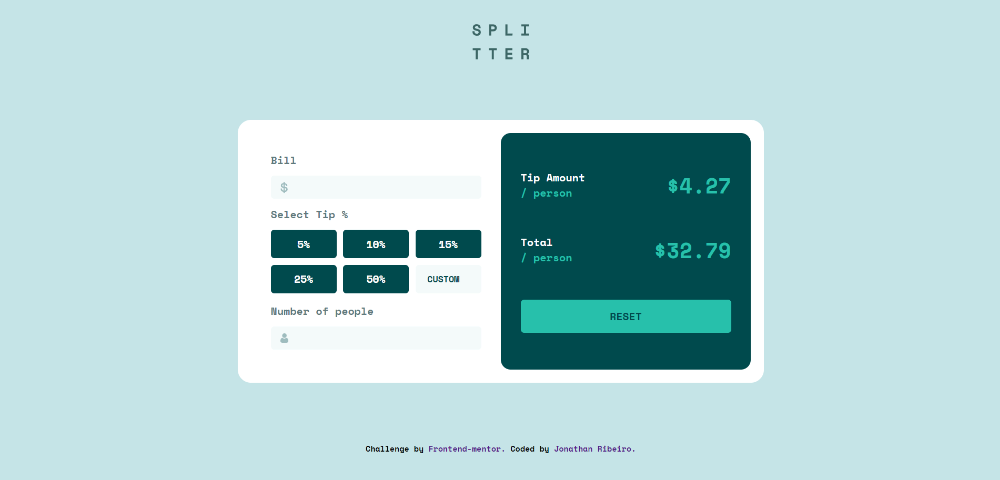

# Frontend Mentor - Tip calculator app solution

This is a solution to the [Tip calculator app challenge on Frontend Mentor](https://www.frontendmentor.io/challenges/tip-calculator-app-ugJNGbJUX). Frontend Mentor challenges help you improve your coding skills by building realistic projects.

## Table of contents

- [Overview]
  - [The challenge]
  - [Screenshot]
  - [Links]
- [My process]
  - [Built with]
- [Author]

## Overview

This is an interesting challenge for the developer to improve their frontend skills, as it works the CSS and Javascript part.

### The challenge

Users should be able to:

- View the optimal layout for the app depending on their device's screen size
- See hover states for all interactive elements on the page
- Calculate the correct tip and total cost of the bill per person

### Screenshot

### Links

- Solution URL: (https://github.com/jowribas/Tip-calculator)
- Live Site URL: (https://tipcalculatorch.netlify.app/)

## My process

the beginning of the project I started structuring the challenge through HTML, 
then I started the design with css, soon after I worked with javascript.
In javascript I used events and functions.

### Built with

- Semantic HTML5 markup
- CSS custom properties
- Flexbox
- CSS Grid
- Javascript

## Author

- Website - [Tip calculator](https://tipcalculatorch.netlify.app/)
- Frontend Mentor - [@jowribas](https://www.frontendmentor.io/profile/jowribas)
